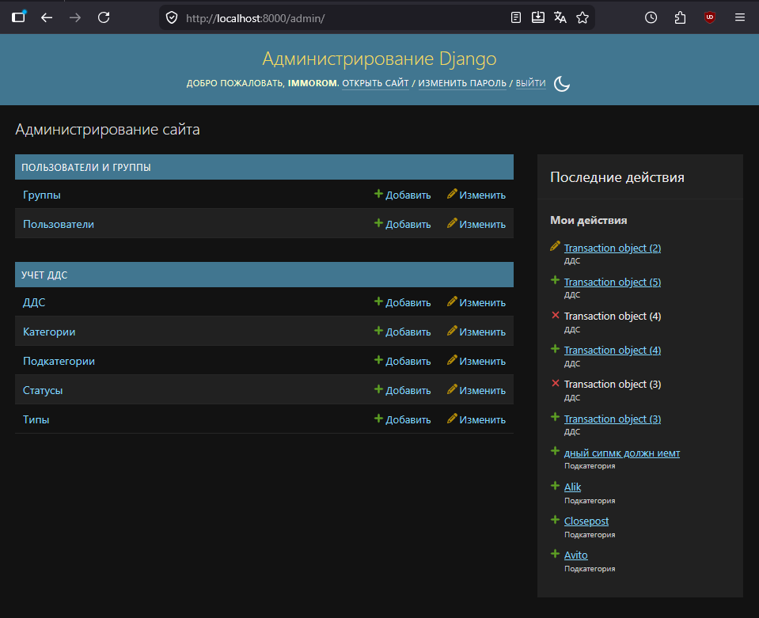
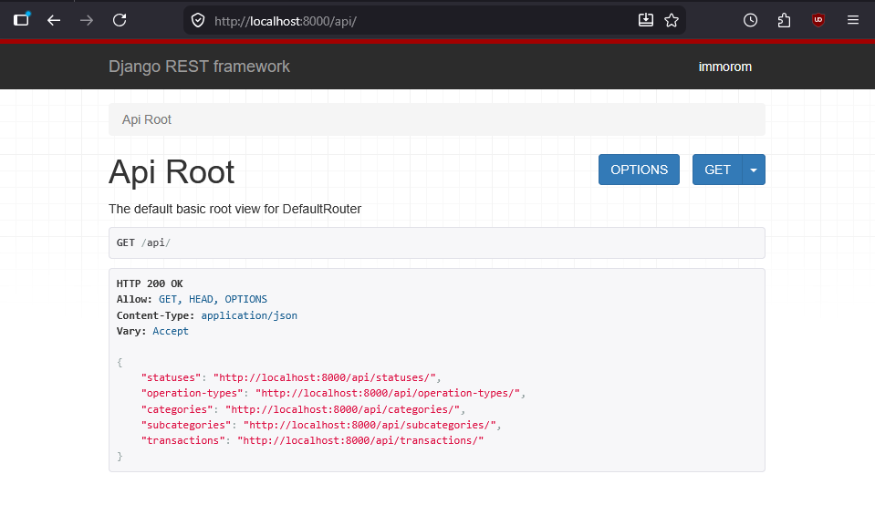

# Тестовое задание
на позицию backend python dev

## Способы запуска приложения

### Вручную

1. [Опционально] Виртуальное окружение (в корне репозитория): \
создание: `python -m venv .venv` \
активация: \
`.venv\Scripts\activate` (Windows) \
`source .venv/bin/activate` (Linux)

2. Все последующие комманды выполняются в директории *src*

3. Все зависимости проекта хранятся в файле *requirements.txt* \
установка: `pip install -r requirements.txt`

4. Уже готовая и заполненная база данных (SQLite) находится в папке по-умолчанию: *src\db.sqlite3* \
(логин и пароль суперпользователя: `immorom`) \
\
Так же есть и файлы для ручного создания БД:
    1) миграции в *src\cash_flow\migrations* \
    проводить с помощью: `python manage.py migrate`
    
    2) выгрузка записей в *src\fixtures\initial_data.json* \
    загрузка: `python manage.py loaddata fixtures/initial_data.json`

    3) создание пользователя для работы в приложении: `python manage.py createsuperuser`

5. Запуск сервера с приложением: `python manage.py runserver`

### С помощью Docker

1. Все необходимые файлы конфигурации *compose.yaml*, *Dockerfile*, *requirements.txt* находятся в корне репозитория \
сборка и запуск контейнера: `docker compose up --build`

## Краткое руководство

Пользовательский интерфейс (django-admin) доступен по адресу `http://localhost:8000/` \

Навигационная страница тестиорвания API доступна по адресу `http://localhost:8000/api/` \
